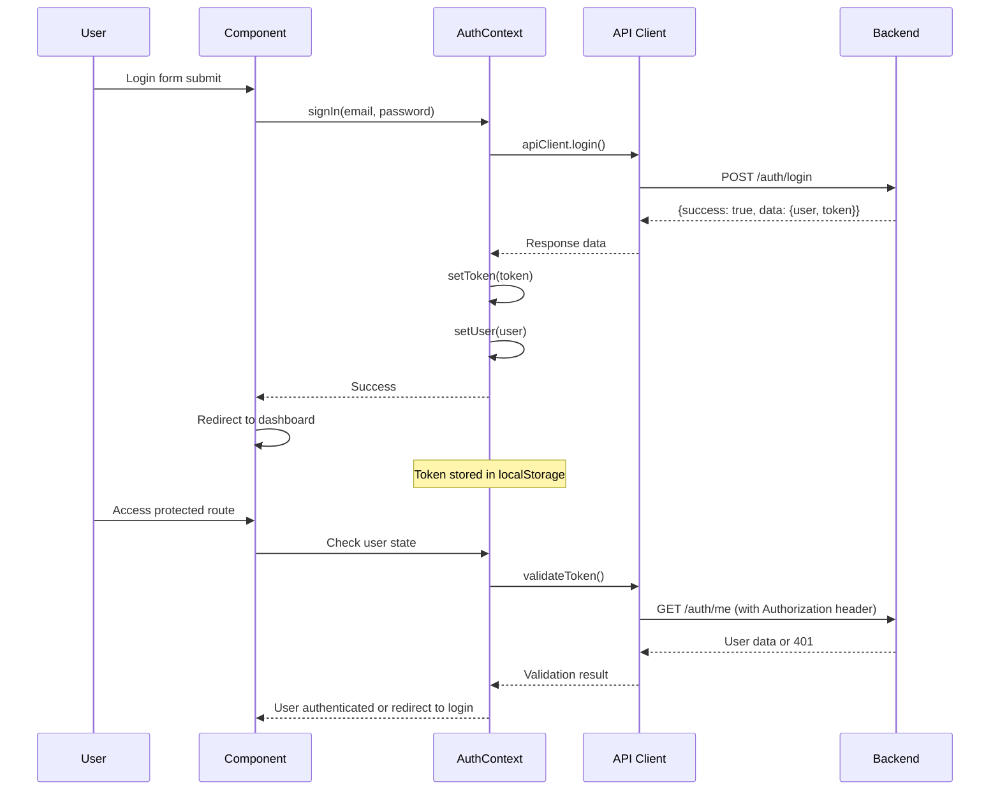

# Job Board Frontend

A modern job board application frontend built with React, TypeScript, Vite, and Tailwind CSS. Features responsive design, role-based interfaces, and real-time application management.

## 🚀 Quick Start

### Prerequisites
- Node.js 18+ and npm
- Backend API running (see backend README)

### Installation

```bash
# Clone and install dependencies
git clone https://github.com/shubham62462/jobboard-frontend.git
npm install

# Environment setup
cp .env.example .env
# Configure your .env file (see Environment Variables section)

# Start development server
npm run dev
```

### Test Account Credentials

```bash
# Employer Account
Email: employer3@test.com
Password: password

# Candidate Account  
Email: candidate3@test.com
Password: password

```

## 🏗️ Architecture Overview

### System Architecture

```
React Components → Custom Hooks → API Client → Backend API
                     ↓
                Context Providers (Auth, Theme)
                     ↓
               localStorage (Token Storage)
```

### Directory Structure

```
frontend/
├── src/
│   ├── components/          # Reusable UI components
│   │   ├── common/         # Generic components (Button, Input, etc.)
│   │   ├── jobs/           # Job-related components
│   │   ├── applications/   # Application-related components
│   │   └── Layout/         # Layout components
│   ├── pages/              # Page components
│   │   ├── auth/           # Login, Register, etc.
│   │   ├── jobs/           # Job listing, details, create
│   │   ├── applications/   # Application management
│   │   └── HomePage/       # User dashboards
│   ├── hooks/              # Custom React hooks
│   │   ├── useJob.ts       # Specific job management hook
│   │   ├── useJobApplications.ts     # Job application hook
│   │   ├── useMyJobs.ts              # My Job management hooks
│   │   ├── useApplication.ts         # Specific Application hook
│   │   ├── useApplications.ts        # Application hooks
│   │   ├── useApplicationMutation.ts # Application Mutation hooks
│   │   ├── useEmployerJob.ts         # Employer Job hooks
│   │   └── useMyJob.ts               # My Job hooks
│   ├── contexts/           # React context providers
│   │   └── AuthContext.tsx # Authentication context
│   ├── lib/                # Utilities and configurations
│   │   ├── api.ts          # API client
│   ├── types/              # TypeScript type definitions
│   │   └── index.ts
│   ├── services/           
│   │   ├── applicationService.ts     # Application Service
│   │   ├── authService.ts            # Auth Service
│   │   └── jobService.ts             # Job Service
│   ├── App.tsx             # App component
│   ├── App.tsx             # Main application component
│   └── index.css           # Main styling file
├── public/                 # Static assets
├── package.json
├── vite.config.ts
├── tailwind.config.js
└── README.md
```

### Component Architecture

```
App
├── AuthProvider (Context)
├── Router
│   ├── PublicRoutes
│   │   ├── LoginPage
│   │   ├── RegisterPage
│   │   └── JobsPage (public view)
│   ├── ProtectedRoutes (authenticated users)
│   │   ├── Dashboard
│   │   ├── MyJobsPage (employers)
│   │   ├── MyApplicationsPage (candidates)
│   │   └── JobDetailsPage
│   └── NotFound
```

### Authentication Flow



## 🔐 Authentication System

### AuthContext Implementation

```typescript
// src/contexts/AuthContext.tsx
export const AuthProvider = ({ children }: AuthProviderProps) => {
  const [user, setUser] = useState<User | null>(null);
  const [loading, setLoading] = useState(true);

  // Initialize auth on app start
  useEffect(() => {
    const initializeAuth = async () => {
      const token = apiClient.getToken();
      if (token) {
        try {
          const response = await apiClient.getMe();
          if (response.success) {
            setUser(response.data.user);
          }
        } catch (error) {
          apiClient.setToken(null);
        }
      }
      setLoading(false);
    };
    
    initializeAuth();
  }, []);

  const signIn = async (email: string, password: string) => {
    const response = await apiClient.login({ email, password });
    if (response.success) {
      apiClient.setToken(response.data.token);
      setUser(response.data.user);
    }
  };
  
  // ... other auth methods
};
```

### API Client with Authentication

```typescript
// src/lib/api.ts
class ApiClient {
  private token: string | null = null;

  setToken(token: string | null) {
    this.token = token;
    if (token) {
      localStorage.setItem('auth_token', token);
    } else {
      localStorage.removeItem('auth_token');
    }
  }

  private async request<T>(endpoint: string, options: RequestInit = {}): Promise<T> {
    const config: RequestInit = {
      headers: {
        'Content-Type': 'application/json',
        ...options.headers,
      },
      ...options,
    };

    // Add auth header if token exists
    const token = this.getToken();
    if (token) {
      config.headers = {
        ...config.headers,
        Authorization: `Bearer ${token}`,
      };
    }

    const response = await fetch(`${this.baseUrl}${endpoint}`, config);
    
    if (!response.ok) {
      const errorData = await response.json().catch(() => null);
      throw new Error(errorData?.error || 'Request failed');
    }

    return response.json();
  }
}
```

## 🎣 Custom Hooks

### Job Management Hooks

```typescript
// src/hooks/useJobs.ts
export const useJobs = (params: JobQueryParams) => {
  const [jobs, setJobs] = useState<Job[]>([]);
  const [loading, setLoading] = useState(true);
  const [error, setError] = useState<string | null>(null);
  const [pagination, setPagination] = useState<PaginationInfo>();

  const fetchJobs = async () => {
    try {
      setLoading(true);
      const response = await apiClient.getJobs(params);
      setJobs(response.data);
      setPagination(response.pagination);
    } catch (error) {
      setError(error.message);
    } finally {
      setLoading(false);
    }
  };

  useEffect(() => {
    fetchJobs();
  }, [params.page, params.search, params.location]);

  return { jobs, loading, error, pagination, refetch: fetchJobs };
};
```

### Application Management Hooks

```typescript
// src/hooks/useMyApplications.ts
export const useMyApplications = () => {
  const [applications, setApplications] = useState<Application[]>([]);
  
  const createApplication = async (data: CreateApplicationRequest) => {
    const response = await apiClient.createApplication(data);
    if (response.success) {
      await fetchMyApplications(); // Refresh list
      toast.success('Application submitted successfully!');
    }
  };

  return { applications, createApplication, loading, error };
};
```

## 🎨 UI Components

### Component Library Structure

```typescript
// src/components/common/Button.tsx
interface ButtonProps {
  variant?: 'primary' | 'secondary' | 'ghost';
  size?: 'sm' | 'md' | 'lg';
  loading?: boolean;
  icon?: ReactNode;
  children: ReactNode;
}

const Button = ({ variant = 'primary', size = 'md', loading, icon, children, ...props }: ButtonProps) => {
  const baseClasses = 'inline-flex items-center justify-center rounded-md font-medium transition-colors';
  const variantClasses = {
    primary: 'bg-blue-600 text-white hover:bg-blue-700',
    secondary: 'bg-gray-200 text-gray-900 hover:bg-gray-300',
    ghost: 'text-gray-600 hover:text-gray-900'
  };
  
  return (
    <button 
      className={cn(baseClasses, variantClasses[variant], sizeClasses[size])}
      disabled={loading}
      {...props}
    >
      {loading ? <LoadingSpinner /> : icon}
      {children}
    </button>
  );
};
```

### Form Components

```typescript
// src/components/common/Input.tsx
interface InputProps extends InputHTMLAttributes<HTMLInputElement> {
  label?: string;
  error?: string;
  icon?: ReactNode;
}

const Input = forwardRef<HTMLInputElement, InputProps>(
  ({ label, error, icon, className, ...props }, ref) => {
    return (
      <div className="space-y-1">
        {label && <label className="text-sm font-medium text-gray-700">{label}</label>}
        <div className="relative">
          {icon && <div className="absolute left-3 top-1/2 transform -translate-y-1/2">{icon}</div>}
          <input
            ref={ref}
            className={cn(
              'w-full px-3 py-2 border border-gray-300 rounded-md focus:ring-blue-500 focus:border-blue-500',
              icon && 'pl-10',
              error && 'border-red-300 focus:ring-red-500 focus:border-red-500',
              className
            )}
            {...props}
          />
        </div>
        {error && <p className="text-red-600 text-sm">{error}</p>}
      </div>
    );
  }
);
```

## 🛡️ Security Considerations

### Client-Side Security

#### Token Management
```typescript
// Secure token storage
class ApiClient {
  setToken(token: string | null) {
    if (token) {
      localStorage.setItem('auth_token', token);
    } else {
      localStorage.removeItem('auth_token');
    }
  }

  getToken(): string | null {
    return localStorage.getItem('auth_token');
  }
}

// Automatic token cleanup on logout
const signOut = async () => {
  try {
    await apiClient.logout();
  } finally {
    apiClient.setToken(null);
    setUser(null);
  }
};
```

#### Route Protection
```typescript
// src/components/auth/ProtectedRoute.tsx
const ProtectedRoute = ({ children, requiredRole }: ProtectedRouteProps) => {
  const { user, loading } = useAuth();
  const location = useLocation();

  if (loading) {
    return <LoadingSpinner />;
  }

  if (!user) {
    return <Navigate to="/login" state={{ from: location }} replace />;
  }

  if (requiredRole && user.role !== requiredRole) {
    return <Navigate to="/unauthorized" replace />;
  }

  return <>{children}</>;
};
```

#### API Request Configuration
```typescript
// Configure API client with CSRF protection
const apiClient = new ApiClient({
  baseURL: import.meta.env.VITE_API_URL,
  withCredentials: true, // Include cookies for CSRF tokens
  headers: {
    'Content-Type': 'application/json',
    'X-Requested-With': 'XMLHttpRequest' // CSRF protection header
  }
});
```

### Environment Configuration

```env
# .env file
VITE_API_URL=http://localhost:5000/api/v1

# Production environment
VITE_API_URL=https://your-api-domain.com/api/v1
```

### Content Security Policy

```html
<!-- index.html -->
<meta http-equiv="Content-Security-Policy" content="
  default-src 'self';
  script-src 'self' 'unsafe-inline';
  style-src 'self' 'unsafe-inline';
  img-src 'self' data: https:;
  connect-src 'self' https://your-api-domain.com;
  font-src 'self' https://fonts.gstatic.com;
">
```

## 📱 Responsive Design

### Tailwind CSS Configuration

```javascript
// tailwind.config.js
module.exports = {
  content: ['./src/**/*.{js,ts,jsx,tsx}'],
  theme: {
    extend: {
      colors: {
        primary: {
          50: '#eff6ff',
          500: '#3b82f6',
          600: '#2563eb',
          700: '#1d4ed8'
        }
      },
      screens: {
        'xs': '475px',
      }
    }
  },
  plugins: [
    require('@tailwindcss/forms'),
    require('@tailwindcss/typography')
  ]
};
```

### Mobile-First Design

```typescript
// Responsive component example
const JobCard = ({ job }: { job: Job }) => {
  return (
    <div className="
      bg-white p-4 rounded-lg shadow-md 
      sm:p-6 
      lg:flex lg:items-center lg:justify-between
    ">
      <div className="flex-1 min-w-0">
        <h3 className="text-lg font-semibold text-gray-900 truncate sm:text-xl">
          {job.title}
        </h3>
        <div className="mt-2 flex flex-col sm:flex-row sm:items-center gap-2 sm:gap-4">
          <span className="text-gray-600">{job.location}</span>
          <span className="text-gray-600">{job.salary}</span>
        </div>
      </div>
      <div className="mt-4 sm:mt-0 sm:ml-4">
        <Button className="w-full sm:w-auto">
          View Details
        </Button>
      </div>
    </div>
  );
};
```

## 🚀 Build & Deployment

### Development

```bash
# Start development server
npm run dev

# Type checking
npm run type-check
```

### Production Build

```bash
# Build for production
npm run build

# Preview production build
npm run preview

# Analyze bundle size
npm run analyze
```

### Docker Deployment

```dockerfile
# Multi-stage build for optimized production image
FROM node:18-alpine as builder

WORKDIR /app
COPY package*.json ./
RUN npm ci

COPY . .
RUN npm run build

FROM nginx:alpine
COPY --from=builder /app/dist /usr/share/nginx/html
COPY nginx.conf /etc/nginx/conf.d/default.conf
EXPOSE 80
CMD ["nginx", "-g", "daemon off;"]
```

### Nginx Configuration

```nginx
# nginx.conf
server {
  listen 80;
  root /usr/share/nginx/html;
  index index.html;

  # Handle client-side routing
  location / {
    try_files $uri $uri/ /index.html;
  }

  # API proxy (optional)
  location /api/ {
    proxy_pass http://backend:5000;
    proxy_set_header Host $host;
    proxy_set_header X-Real-IP $remote_addr;
  }

  # Security headers
  add_header X-Frame-Options "SAMEORIGIN" always;
  add_header X-XSS-Protection "1; mode=block" always;
  add_header X-Content-Type-Options "nosniff" always;
}
```

## 🐛 Troubleshooting

### Common Issues

1. **CORS Errors**
   - Ensure backend CORS is configured for your frontend URL
   - Check that credentials are included in requests

2. **Authentication Issues**
   - Verify JWT token is being sent in Authorization header
   - Check token expiration and refresh logic

3. **API Connection Issues**
   - Confirm VITE_API_URL is correctly configured
   - Check network tab for failed requests

4. **Build Issues**
   - Clear node_modules and npm cache
   - Ensure all environment variables are set

### Development Tools

```bash
# Useful debugging commands
npm run dev -- --debug
npm run build -- --sourcemap
npm run preview -- --port 4173
```

## 📞 Support

For issues and questions:
- Check browser developer console for errors
- Review network tab for API request failures
- Examine component props and state in React DevTools

---

**Built with ⚡ using React, TypeScript, Vite, and Tailwind CSS**
